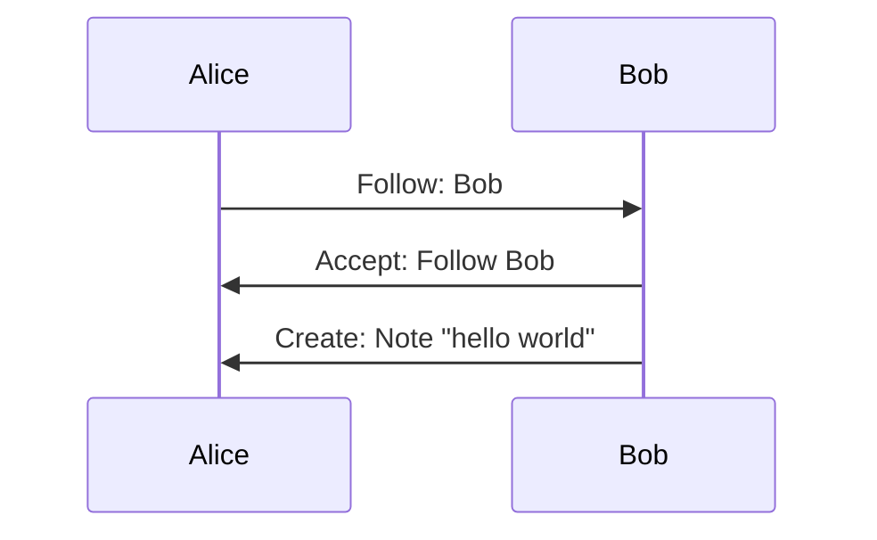
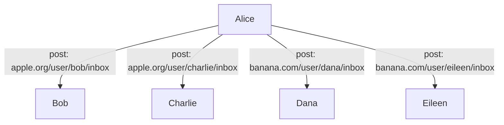

# NortHFutures x ActivityPub

> Part of the Community Infrastructure / brokerage work package.

The idea is to get all the organisations to federate their information to make a network of networks, rather than lots of information silos.

For federation to work, it needs to be adopted by all the partners that want to be a part of it it and they need to talk the same language.
The W3C standards organisation already recommends the ActivityPub protocol for federation of social networks,
so it makes sense to try and build on top of this or adapt it for out use case.

Basing the federation on top of an existing standard is very beneficial:

- All the work has already been done to design and build the protocol
- There are already nodes of the federation deployed in the real world
- We could contribute an extension to the protocol for our specific usage

## ActivityPub

[ActivityPub](https://activitypub.rocks) is the existing standard for creating federated social networks
and it is recommended by the [w3c](https://www.w3.org/) the web standards organisation.

It builds on other standards too:

- [WebFinger](https://www.rfc-editor.org/rfc/rfc7033) is a standard for looking up users based on a username and a domain they are based on
- [ActivityStreams 2.0](https://www.w3.org/TR/activitystreams-core/) is a standard for structuring JSON documents of streams of activities of different types by different actors
- [JSON-LD 1.1](https://www.w3.org/TR/json-ld/) is a data serialisation format that adds linked documents to the JSON format

Under ActivityPub there are `Actors` who perform `Activities` that create, updated & delete `Objects` of different types across multiple servers.



In this diagram there are two `Actors`, **Alice** & **Bob**.

1. **Alice** requests to follow **Bob**
2. **Bob** accepts the follow request
3. **Bob** creates a Note (a post or status) saying "hello world"

If Alice had more followers, the information would flow like this:



Under this network **Alice** is followed by:

- **Bob** on the `apple.org` server
- **Charlie** on the `apple.org` server
- **Dana** on the `banana.com` server
- **Eileen** on the `banana.com` server

When **Alice** posts, it posts a `Create` activity to each user that is following them on their own server.
So **Bob** and **Charlie** both get the activity on `apple.org` and **Dana** and **Eileen** get the activity on `banana.com`.

And the (simplified) payload for each message will look something like below and the `to` field is set according to the user it is being sent to.

```json
{
  "type": "Create",
  "actor": "https://apple.org/users/alice",
  "to": ["https://apple.org/users/bob"],
  "object": {
    "type": "Note",
    "content": "<p>hello world</p>"
  },
  "signature": "..."
}
```

> Skipped here but important, `signature` contains information about how the message was signed.
> In ActivityPub each user has a public-private key pair.
> Messages are signed by the user's private key to provide authenticity.

<details>
<summary>optimisation</summary>

This interaction can optionally be reduced if the server provides a "shared inbox", then **Alice** only needs to send one message to each server that contains users that follow them.
To achieve this **Alice** instead sets the `to` and `cc` in the `object` to:

```json
{
  "to": ["https://www.w3.org/ns/activitystreams#Public"],
  "cc": ["https://apple.org/users/alice/followers"]
}
```

Then **Alice** only needs to post the message to `apple.org/inbox` and `banana.com/inbox`

</details>

Under this system Actors on any server can follow Actors on other servers and receive their activities.
There are several types of activities that can be sent, relevant to NortHFutures there are:

- [Event](https://www.w3.org/TR/activitystreams-vocabulary/#dfn-event) an event a partner is hosting
- [Note](https://www.w3.org/TR/activitystreams-vocabulary/#dfn-note) a blog post about something a partner is doing
- [Place](https://www.w3.org/TR/activitystreams-vocabulary/#dfn-place) a place the partner is offering a service

For a full list:

- [Activity Types](https://www.w3.org/TR/activitystreams-vocabulary/#activity-types)
- [Actor Types](https://www.w3.org/TR/activitystreams-vocabulary/#actor-types)
- [Object Types](https://www.w3.org/TR/activitystreams-vocabulary/#object-types)

## API

At a minimum, each node in the network needs to implement these endpoints on their server to send and receive activities.

### webfinger

`GET /.well-known/webfinger?resource=...`

This is used to look up a user on a server, e.g. `curl https://example.com/.well-known?acct:alice@example.com` and returns something like this:

```json
{
  "aliases": ["https://hyem.tech/@rob", "https://hyem.tech/users/rob"],
  "links": [
    {
      "href": "https://hyem.tech/users/rob",
      "rel": "self",
      "type": "application/activity+json"
    }
  ],
  "subject": "acct:rob@hyem.tech"
}
```

### Actor profile

This is the endpoint `webfinger` returns that describes the ActivityPub profile,
e.g. `https://hyem.tech/users/rob` with a `Accept: application/activity+json` header set.

This describes the actor and their various endpoints like their inbox, outbox and follower/following lists.

```json
{
  "@context": ["https://www.w3.org/ns/activitystreams", "..."],
  "id": "https://hyem.tech/users/rob",
  "type": "Person",
  "following": "https://hyem.tech/users/rob/following",
  "followers": "https://hyem.tech/users/rob/followers",
  "inbox": "https://hyem.tech/users/rob/inbox",
  "outbox": "https://hyem.tech/users/rob/outbox",
  "featured": "https://hyem.tech/users/rob/collections/featured",
  "featuredTags": "https://hyem.tech/users/rob/collections/tags",
  "preferredUsername": "rob",
  "name": "Rob Anderson",
  "summary": "...",
  "url": "https://hyem.tech/@rob",
  "manuallyApprovesFollowers": false,
  "discoverable": true,
  "indexable": true,
  "published": "2022-11-30T00:00:00Z",
  "memorial": false,
  "devices": "https://hyem.tech/users/rob/collections/devices",
  "publicKey": "...",
  "endpoints": { "sharedInbox": "https://hyem.tech/inbox" },
  "icon": { "type": "Image", "mediaType": "image/jpeg", "url": "..." },
  "image": { "type": "Image", "mediaType": "image/jpeg", "url": "..." }
}
```

This then describes the other endpoints which can be used to federate information i.e. the values for `inbox`, `outbox`, `endpoints.sharedInbox`, `following`, `followers`

Those endpoints would need to be implemented too following ActivityStreams.

### API Notes

- Webfinger might not be needed, nodes could hard-link to the actor profile
- implementors would need some sort of backoff system for putting things into inboxes and retrying if the server is unavailable
- each user needs a public/private key pair to sign messages and prove authenticity
  - if they sign with the private the public can prove they did

## OSS Platforms

### Ghost

- No AP support ([it is WIP though](https://activitypub.ghost.org/))
- We could make a satellite service that uses the Ghost Admin API to add the support and inject content into the site
- The theme would need to support it and show provenance

### Wordpress

- There is an [AP plugin](https://github.com/Automattic/wordpress-activitypub), but it is for allowing followers and not rebroadcasting
- There could be another plugin that does the rebroadcasting based on a follow list

---

**useful links**

- https://seb.jambor.dev/posts/understanding-activitypub/
- https://w3c.github.io/activitypub/
- https://www.w3.org/TR/activitystreams-vocabulary/#dfn-tombstone
- https://activitypub.rocks/
- https://mermaid.live
